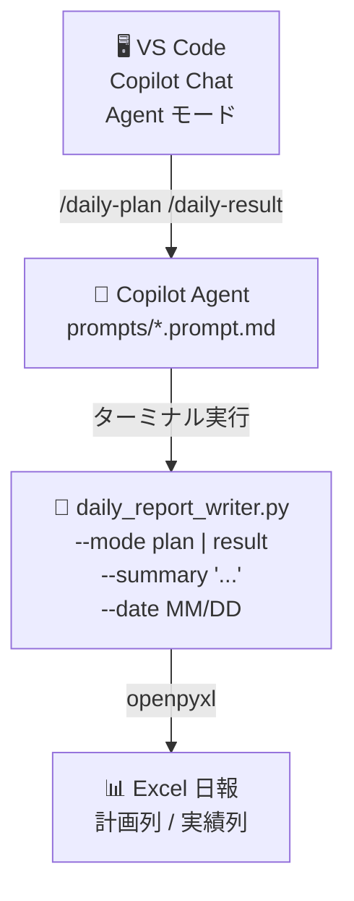
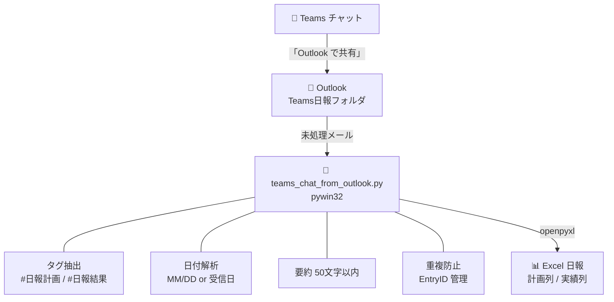
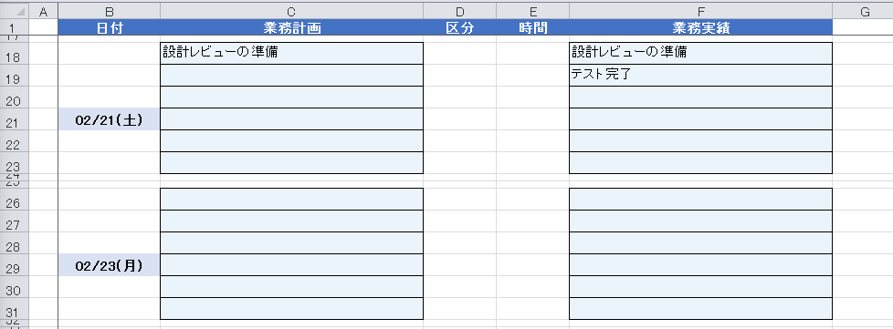

# teams-daily-report

[](LICENSE)
[](https://www.python.org/downloads/)


ローカル PC 上の **Excel 日報** への書き込みを自動化する、**2本の独立したツール**を収録しています。

---

## ツール1: Copilot スラッシュコマンド（`daily_report_writer`）

VS Code の Copilot Chat から **その場でテキストを入力するだけ** で Excel 日報に書き込みます。  
Teams・Outlook・pywin32 はいっさい不要です。



**特徴**
- Outlook / Teams の操作は不要
- 日付省略時は今日の日付を自動使用
- `要約:` プレフィックス不要。入力テキストをそのまま書き込む
- `.xlsx` / `.xlsm` どちらにも対応

---

## ツール2: Outlook メール経由（`teams_chat_from_outlook`）

Teams チャットを **「Outlookで共有」** し、メールを解析して Excel に一括書き込みします。  
Microsoft Graph のアプリ登録が不可・管理者権限なしの環境向けの実装です。



**特徴**
- Microsoft Graph の **アプリ登録不要**
- Power Automate / Power Apps を使わない
- 管理者権限不要
- Teams の通常運用（チャット投稿）を変えない
- まとめて処理：1日の投稿分を夕方にまとめて Excel へ反映可能

---

## チャット投稿ルール（重要）

| タグ | 書き込み先 | 書式例 |
|---|---|---|
| `#日報計画` | 計画列（C列）| `#日報計画 12/25 プロジェクト計画書作成` |
| `#日報結果` | 実績列（F列）| `#日報結果 12/24 テスト完了` |
| `#日報` | 実績列（F列、結果扱い）| `#日報 12/20 会議資料作成` |

- 日付省略時はメール受信日に記録
- `要約:` プレフィックスは省略可能。**空白・カンマはどちらの場合も使用可**（テキストは行末まで取得）  
  例: `#日報計画 12/20 会議資料の作成, 確認`
- 要約は **50文字以内**（自動切り詰め）
- 1メッセージに複数タグ可。投稿者は自分/他人どちらでも可

---

## セットアップ

### 1. Python 環境

Python 3.9 以上（Windows）

```powershell
python -m venv .venv
.venv\Scripts\activate
pip install -r requirements.txt
```

※ pywin32 の COM 登録が必要な場合：

```powershell
python -m pywin32_postinstall -install
```

---

### 2. 環境設定ファイル（.env）の作成

`.env.example` をコピーして `.env` ファイルを作成し、実際の環境に合わせて設定します。

```powershell
Copy-Item .env.example .env
notepad .env
```

`.env` ファイルで設定する主な項目：

```bash
# Outlook設定
OUTLOOK_FOLDER=Teams日報

# Excelパス（方法1: 直接指定 - 推奨）
EXCEL_PATH=C:\Users\yamada\OneDrive - 株式会社ABC\営業部\業務管理\業務内容報告書\{fiscal_year}年度\{month_folder}\営業1課\（{month_name}_山田太郎）業務内容報告書.xlsm

# または（方法2: テンプレートから生成）
EXCEL_COMPANY=株式会社ABC
EXCEL_DEPARTMENT=営業部-01.庶務
EXCEL_TEAM=営業1課
EXCEL_USER_NAME=山田太郎
```

**環境変数一覧**:

| 変数名 | 必須/省略可 | デフォルト値 | 説明 | 対象ツール |
|---|---|---|---|---|
| `EXCEL_PATH` | **必須**（推奨） | なし | Excel ファイルのフルパス（テンプレート変数使用可）| 両方 |
| `OUTLOOK_FOLDER` | 省略可 | `Teams日報` | Outlook のフォルダ名 | ツール2のみ |
| `PLAN_COL` | 省略可 | `C` | 計画列 | 両方 |
| `RESULT_COL` | 省略可 | `F` | 実績列 | 両方 |
| `DATE_COL` | 省略可 | `B` | 日付列 | 両方 |
| `ROWS_PER_DAY` | 省略可 | `6` | 1日あたりの入力行数 | 両方 |
| `EXCEL_COMPANY` | 省略可※ | `株式会社サンプル` | 会社名（`EXCEL_PATH` 未設定時のパス生成用）| 両方 |
| `EXCEL_DEPARTMENT` | 省略可※ | `部署名-01.庶務事項` | 部署名（同上）| 両方 |
| `EXCEL_TEAM` | 省略可※ | `チームA` | チーム名（同上）| 両方 |
| `EXCEL_USER_NAME` | 省略可※ | `山田太郎` | 氏名（同上）| 両方 |

※ `EXCEL_PATH` を直接指定する場合は不要。未指定時はこれらでパスを自動生成。

**ポイント**:
- `.env` ファイルは個人情報を含むため、Git にコミットされません
- `{fiscal_year}`, `{month_folder}`, `{month_name}` は実行時に自動置換されます
- **月が替わっても `.env` ファイルの更新は不要です**（テンプレート変数が自動的に置換されます）
- 詳細は `.env.example` を参照してください

---

### 3. Outlook 側の準備

1. Outlook（Windowsアプリ）を起動
2. **受信トレイ配下に**フォルダを作成  
   例: `Teams日報`（`.env` の `OUTLOOK_FOLDER` と同じ名前にする）
3. Teams チャットで日報にしたいメッセージを  
   **「… → Outlook で共有」**

（必要であれば Outlook ルールで自動振り分け可能）

---

### 4. Excel 日報の構造

本ツールは特定のExcel構造を前提としています。

#### ファイル配置

Excel ファイルのパスは `.env` ファイルで設定します（上記参照）。

自動生成されるパスの例:
```text
{OneDrive}\業務内容報告書\{年度}年度\{月フォルダ}\{グループ名}\{氏名}.xlsm
```

具体例:
```text
C:\Users\{username}\OneDrive - 株式会社サンプル\部署名-01.庶務事項\
業務管理\業務内容報告書\2025年度\09_12月\チームA\
（12月_山田太郎）業務内容報告書.xlsm
```

**注意**: 年度・月フォルダーは実行日から自動計算されます（4月始まりの年度）。

#### テンプレート変数の自動置換

Excel パスには以下のテンプレート変数が使用できます：

| 変数 | 説明 | 例（2025年12月実行時） | 例（2026年1月実行時） |
|------|------|------------------------|----------------------|
| `{fiscal_year}` | 年度（4月始まり） | 2025 | 2025 |
| `{month_folder}` | 月フォルダー形式 | 09_12月 | 10_1月 |
| `{month_name}` | 月名のみ | 12月 | 1月 |

**メリット**: 一度設定すれば、月が替わっても自動的に正しいパスが生成されます。

```bash
# .env ファイルの設定例
EXCEL_PATH=C:\Users\yamada\OneDrive\業務内容報告書\{fiscal_year}年度\{month_folder}\（{month_name}_山田太郎）.xlsm

# 2025年12月に実行 → C:\Users\yamada\OneDrive\業務内容報告書\2025年度\09_12月\（12月_山田太郎）.xlsm
# 2026年1月に実行 → C:\Users\yamada\OneDrive\業務内容報告書\2025年度\10_1月\（1月_山田太郎）.xlsm
# 2026年4月に実行 → C:\Users\yamada\OneDrive\業務内容報告書\2026年度\01_4月\（4月_山田太郎）.xlsm
```

#### シート構造

- シート名: `実施申請・報告書（{年}{月}）` のパターンを含むシート
- 日付列: **B列** （datetime型、表示形式はmm/dd）
- 計画列: **C列** （入力エリア全体）
- 実績列: **F列** （入力エリア全体）
- 行間隔: 1日あたり **6行** + 2行の余白 = 8行間隔

**重要**: 日付セルの3行上から入力エリアが始まる構造に対応しています。

#### 日付ブロックの例

各日付は6行の入力ブロックで構成され、その後2行の余白があります。  
日付表示は入力ブロックの4行目（B列）にあります。

| 行 | B列 | C列(計画) | F列(実績) |
|----|-----|-----------|-----------|
| 205 | | 計画1 | 実績1 |
| 206 | | 計画2 | 実績2 |
| 207 | | | 実績3 |
| 208 | 12/24 | | 実績4 |
| 209 | (水) | | 実績5 |
| 210 | | | 実績6 |
| 211 | | （余白） | （余白） |
| 212 | | （余白） | （余白） |
| 213 | | 次の日付の入力開始 | |

スクリプトは自動的に各列の空き行を探して書き込みます。

#### サンプル（テスト実行後の状態）



- C18: 計画「設計レビューの準備」（`--mode plan --date 2/21`）
- F18: Excel の自動コピー式（計画と同内容が自動反映）
- F19: 実績「テスト完了」（`--mode result --date 2/21`、offset=1 で2行目から書き込み）

---

## Copilot Chat スラッシュコマンド

VS Code の Copilot Chat（**Agent モード**）から直接 Excel に書き込めます。  
Outlook や Teams の操作は不要です。

### セットアップ

`.env` の `EXCEL_PATH` を設定するだけで使用できます（追加インストール不要）。

### 使い方

Copilot Chat を **Agent モード** に切り替えて入力するだけです。

```
/daily-plan 設計レビューの準備
/daily-plan 2/21 午後の会議資料作成
```

```
/daily-result バグ修正完了
/daily-result 2/20 顧客対応完了
```

### 入力ルール

| 要素 | 書き方 | 例 |
|---|---|---|
| 日付あり | `MM/DD テキスト` | `2/21 設計レビュー` |
| 日付なし | テキストのみ | `バグ修正完了`（今日の日付を自動使用）|
| `要約:` プレフィックス | 不要 | テキストをそのまま書けばOK |

### 書き込み先

| コマンド | 書き込み列 | `.env` 設定 |
|---|---|---|
| `/daily-plan` | 計画列（デフォルト C列）| `PLAN_COL` |
| `/daily-result` | 実績列（デフォルト F列）の **2行目以降**（1行目は計画の自動コピー先）| `RESULT_COL` |

### 詳細ドキュメント

他のプロジェクトでもスラッシュコマンドを使いたい場合は、以下のドキュメントを参照してください：

📖 **[スラッシュコマンド詳細ガイド](docs/SLASH_COMMANDS.md)**
- グローバル設定方法（全プロジェクトで利用可能）
- プロジェクトごとの設定方法
- カスタマイズ方法
- トラブルシューティング

---

## requirements.txt

```txt
requests
openpyxl
pywin32
python-dotenv
```

**依存パッケージの説明**:
- `pywin32`: Outlook COM 自動化
- `openpyxl`: Excel ファイル読み書き
- `python-dotenv`: 環境変数ファイル（`.env`）の読み込み
- `requests`: HTTP リクエスト（将来の拡張用）

---

## 実行

### Copilot スラッシュコマンド（推奨）

VS Code Copilot Chat を **Agent モード** にして入力：

```
/daily-plan 設計レビューの準備
/daily-result 2/21 テスト完了
```

 Copilot Agent が自動的に以下のコマンドを実行します：

```powershell
python src\daily_report_writer.py --mode plan --summary "設計レビューの準備"
python src\daily_report_writer.py --mode result --date 2/21 --summary "テスト完了"
```

直接コマンドで実行することも可能です：

```powershell
python src\daily_report_writer.py --mode plan --summary "要約テキスト"
python src\daily_report_writer.py --mode result --date 2/21 --summary "要約テキスト"
```

### Outlook メール経由（従来モード）

```powershell
python src\teams_chat_from_outlook.py
```

実行内容：

- Outlook フォルダから未処理メールを取得
- `#日報計画 / #日報結果 / #日報` を抽出
- 日付指定があればその日付、なければメール受信日に記録
- Excel の指定日付行に追記
- 処理済みメールは EntryID で管理（`processed_mail_ids.json` に保存、重複防止）

再実行する場合は処理済みIDをクリアします：

```powershell
Remove-Item processed_mail_ids.json
python src\teams_chat_from_outlook.py
```

---

## 運用方法

### 基本的な流れ

本ツールは **「Outlookで共有」と「スクリプト実行」の2ステップ** で動作します。

#### ステップ1: Teamsからメールを転送

1. Teamsチャットで日報を投稿
   ```
   #日報計画 12/24 要約: 設計書作成
   ```

2. メッセージの **「… → Outlookで共有」** をクリック
   - Outlookの受信トレイに届く
   - 手動で「Teams日報」フォルダに移動
   - または、Outlookルールで自動振り分け設定

#### ステップ2: スクリプト実行

```powershell
python src\teams_chat_from_outlook.py
```

### 推奨運用パターン

#### パターンA: まとめて処理（推奨）✨

**「Outlookで共有」は投稿の都度、スクリプトは1日1回**


**メリット**:
- スクリプト実行は1日1回でOK
- 投稿時は「Outlookで共有」ボタンを押すだけ（習慣化しやすい）
- 処理済み管理により、何度実行しても重複しない

#### パターンB: リアルタイム処理

投稿→共有→スクリプト実行を即座に行う方法。

**メリット**: Excelに即座に反映、確認しやすい  
**デメリット**: 投稿のたびにスクリプト実行が必要

### 複数の日報を一度に投稿

1つのメッセージに複数の日報を含めることも可能です：

```
#日報計画 12/24 要約: 設計書作成
#日報結果 12/24 要約: 要件定義完了
#日報結果 12/23 要約: 昨日のレビュー対応完了
```

→ スクリプト実行で3件すべてが処理されます

---

## 設計上のポイント

- **Graph API 不要** - pywin32 による COM 自動化のみ使用
- **管理者依存なし** - ローカル環境のみで完結
- **UI 作成なし** - コマンドライン実行のみ
- **Teams / Outlook の公式機能のみ使用** - 非公式APIやハックなし
- **壊れにくい運用** - シンプルな構成で保守性が高い
- **日付の柔軟性** - タグに日付を明示することで過去分も正確に記録可能
- **重複防止** - EntryID による処理済み管理で同じメールを二重処理しない
- **環境変数で設定管理** - `.env` ファイルで個人情報を管理、ソースコード修正不要

---

## ファイル構成

```text
teams-daily-report/
├── README.md                      # このファイル
├── LICENSE                        # MITライセンス
├── requirements.txt               # Python依存パッケージ
├── .env.example                   # 環境変数設定例（コピーして使用）
├── .env                          # 環境変数設定（各自作成、Gitにコミットしない）
├── .gitignore                    # Git除外設定
├── processed_mail_ids.json        # 処理済みメールID（自動生成）
├── .github/
│   ├── copilot-instructions.md    # Copilot 共通ルール
│   └── prompts/
│       ├── daily-plan.prompt.md   # /daily-plan スラッシュコマンド定義
│       └── daily-result.prompt.md # /daily-result スラッシュコマンド定義
├── src/
│   ├── teams_chat_from_outlook.py # Outlook メール経由モード（従来）
│   └── daily_report_writer.py    # CLI 直接書き込みモード（スラッシュコマンド用）
├── tests/
│   ├── README.md                  # テストスクリプトの説明書
│   ├── create_sample_excel.py     # テスト用サンプル Excel 生成
│   ├── debug_mail_content.py      # メール内容デバッグ
│   ├── debug_mapi_properties.py   # MAPIプロパティ調査
│   ├── test_extract.py            # タグ抽出ロジックテスト
│   ├── test_excel_read.py         # Excel読み込みテスト
│   ├── check_excel_dates.py       # Excel日付確認
│   ├── debug_excel_dates.py       # Excel日付デバッグ
│   └── list_outlook_folders.py    # Outlookフォルダー一覧表示
└── evac/
    ├── README.md                  # 旧仕様ファイルの説明
    ├── fetch_chat_ids.py          # [使用不可] Graph API版（旧仕様）
    ├── .env                      # [使用不可] Graph API設定
    └── .env.example              # [使用不可] Graph API設定例
```

**重要**: `.env` ファイルは各自が作成する個人設定ファイルです。`.gitignore` に含まれているため、Git にコミットされません。

---

## トラブルシューティング

| 症状 | 確認・対処 | デバッグスクリプト |
|---|---|---|
| Excel が開かれているエラー | Excel ファイルを閉じてから再実行 | - |
| Excel ファイルが見つからない | `.env` の `EXCEL_PATH` / テンプレート変数を確認 | `tests\check_current_excel_dates.py` |
| 日付行が見つからない | B列に datetime 型で日付入力・シート名を確認 | `tests\check_current_excel_dates.py` |
| メールが処理されない | タグ・フォルダ名・テキストの有無を確認 | `tests\debug_mail_content.py` |
| 重複書き込みされる | `processed_mail_ids.json` の更新状況を確認 | `tests\test_extract.py` |
| 処理済みを再処理したい | `Remove-Item processed_mail_ids.json` して再実行 | - |

詳細は [tests/README.md](tests/README.md) を参照してください。

> **`processed_mail_ids.json`**: 処理済みメールの EntryID を保存するファイル（自動生成）。Excel の書き込み行は毎回 Excel を読んで空セルを検索するため、行番号は記録しません。

---

## 想定利用シーン

- **個人日報の自動化** - チャットで仕事をしながら日報も自動記録
- **業務記録の証跡保存** - 「いつ何をしたか」を正確に記録
- **過去分の一括登録** - 日付を明示して過去のチャットをまとめて登録
- **チーム内の情報共有** - 他メンバーの重要な発言も日報に記録可能
- **依頼対応の記録** - 「誰の依頼で何をしたか」を残す用途

---

## ライセンス

MIT License

## 免責事項

このツールは個人の業務効率化を目的として作成されたものです。使用する場合は、各自の責任のもとで以下の点に注意してください：

- 実際の環境に合わせてパスや設定を変更してください
- Excelファイルのバックアップを必ず取得してください
- 会社のセキュリティポリシーを遵守してください
- Microsoft Teams、Outlook、Excel の利用規約を確認してください

作者は本ソフトウェアの使用によって生じたいかなる損害についても責任を負いません。
